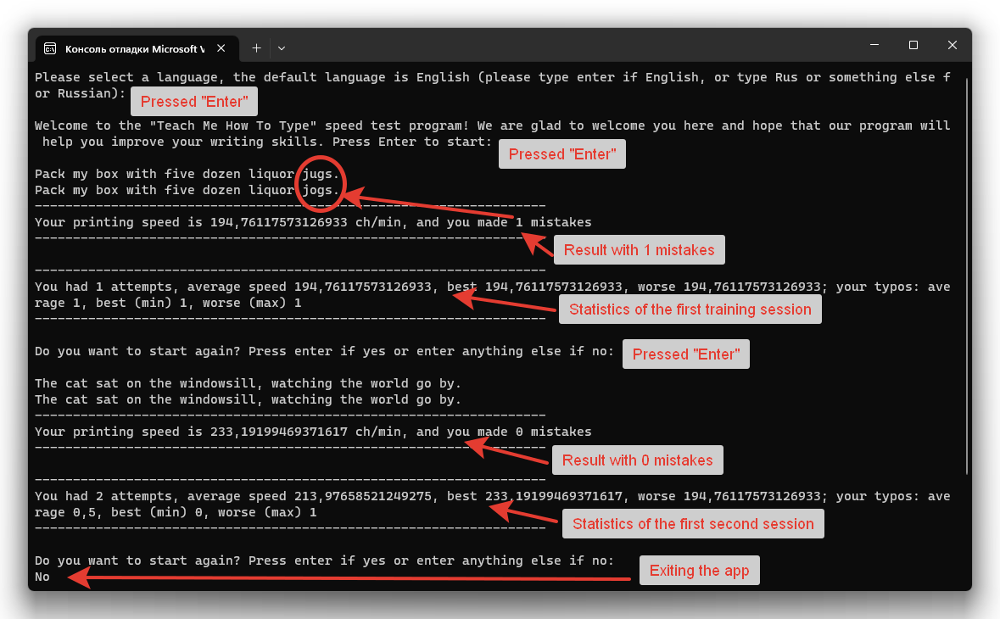
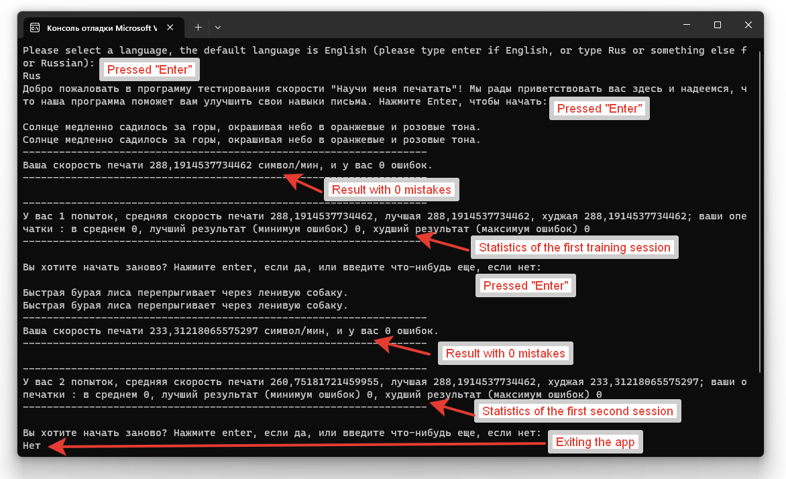

# Programming_C# course
## Lab Work 1 - Teach Me How To Type

Выполнено по [заданию Александра Алексеевича Павлюка](https://gitlab.com/alex-pavlyuk-courses/c-sharp-course-spring-2023/-/tree/main/assignments/01-teach-me-how-to-type)

Задание выполнялось поэтапно согласно задания. Код предшествующих этапов при необходимости модернизировался при написании кода последующих этапов. Этапы разделены в коде комментариями. 

### Замечание
Алгоритм анализа опечаток (этап 3) построен на базе алгоритма поиска метрики расстояния Левенштейна, т.е. эта метрика и показывает пользователю количество опечаток.

Предварительный просмотр окна программы для каждого из выбираемых языков представлены ниже

|English version|Русская версия|
|---------------|--------------|
|||

### Описание работы программы
После запуска программы пользователю предлагается выбрать один из двух языков: русский и английский. Для выбора английского языка пользователю нажать на Enter, для выбора русского языка достаточно написать любую комбинацию символов, например "Рус", и нажать на Enter.
После выбора языка в приложении весь текст взаимодействия с пользователем будет отображаться на выбранном языке.

Выводится приветствие на выбраном языке, для начала работы требуется нажать на Enter после чего случайным образом выбирается один из тренировочных текстов, занесённых в код программы, при этом каждому экземпляру текста соответствует своя версия перевода на каждый из языков, доступным в приложении.
В этот же момент фиксируется момент времени начала тренировки. Требуется ввести текст в точности предложенный программой и нажать на Enter, после чего приложение рассчитает скорость набора заданного текста, а также вычислит количество ошибок и опечаток, занесёт эти данные в память для сбора статистики, и выведет на экран последовательно со статистикой, которая отслеживается для нескольких повторений тренировки, т.е. после этого пользователю предлагается заново тренироваться опять на случайно выбранном тренировочном тексте. Статистика при этом собирается для каждого запуска и вычисляется для следующих показателей: средняя скорость печати в минуту, максимальная и минимальная, а также количество ошибок в среднем, лучший и худщий результаты. Показатели выводятся на экран после вывода результата итерации тренировки.
Если пользователь не желает начинать заново, то достаточно набрать любой текст для выхода из программы, например "Exit" или "Выход", но сработает любая последовательность символов.

